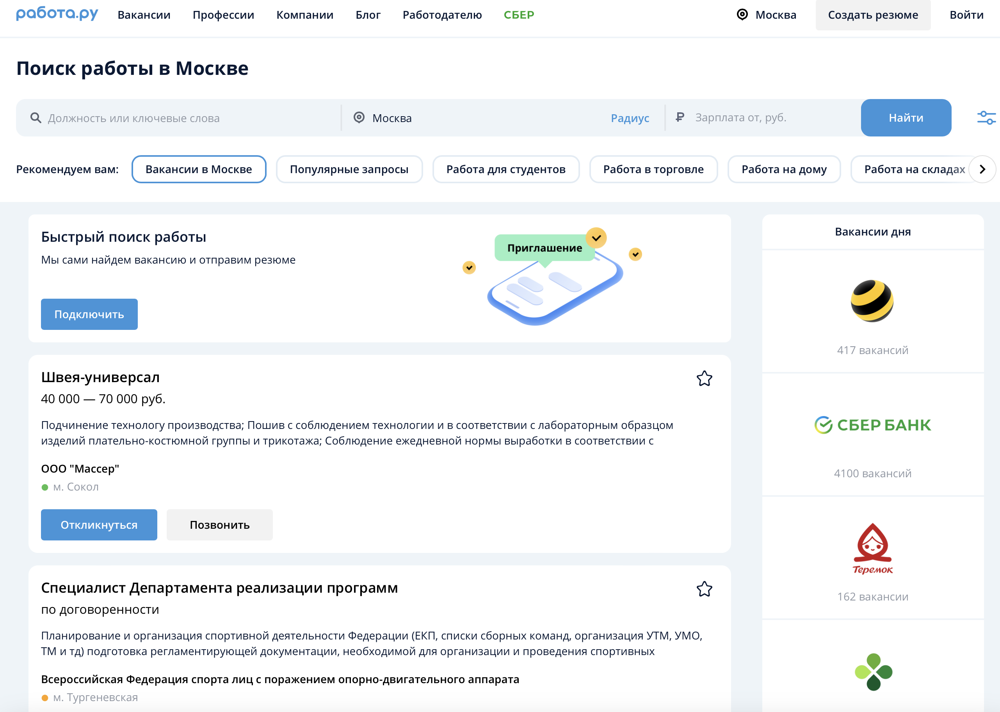
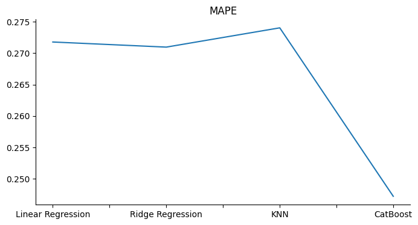

# Предсказание заработной платы (трек от "Работа.ру")



### Общая постановка задачи
- Создать интерпретируемую модель предсказания зарплаты, которая в дальнейшем будет внедряться в сервисы компании.

### Бизнес-цели
- Улучшение опыта соискателей:
  - С помощью модели агрегатор вакансий предоставляет ценную информацию о предполагаемой заработной плате, что помогает кандидатам более осознанно выбирать вакансии, соответствующие их ожиданиям и финансовым целям.
- Эффективность подбора вакансий:
  - Кандидаты могут легко фильтровать и сортировать вакансии в соответствии с ожидаемым уровнем заработной платы, что сокращает время на поиск подходящих предложений.
- Повышение конкурентоспособности сервиса "Работа.ру":
  - Внедрение инновационного сервиса, способного предоставлять точные предсказания заработной платы, может привлечь больше пользователей и сделать платформу более привлекательной для работодателей и соискателей. Так, работодатели могут эффективнее планировать бюджеты для потенциальных кандидатов, а будущие сотрудники будут иметь представление о своей ценности на рынке труда. В совокупности эти факторы формируют конкурентное преимущество перед другими агрегаторами вакансий.
- Поддержка HR-процессов:
  - Работодатели могут использовать данные о заработной плате для уточнения и оптимизации своих вакансий, привлекая наиболее подходящих кандидатов и уменьшая число несоответствий в ожиданиях.
- Анализ рынка труда и возможные перспективы:
  - Агрегатор вакансий может использовать данные о заработной плате для анализа рынка труда, определения тенденций, проведения точечных исследований. Далее результаты анализа и исследований могут стать отдельным монетизируемым продуктом компании.

- Какие **бизнес-метрики** мы можем улучшить с помощью проекта:
  - Время нахождения вакансии кандидатом.
  - Время между размещением вакансии (т.е. выявления потребности) работодателем и трудоустройством.
    - Тем самым повышая лояльность всех контрагентов рынка труда, но это абстрактный показатель, который можно замерить прокси-метриками, упомянутыми выше.
  - Рейтинг сервиса "Работа.ру" в общем перечне сервисов.
  - Финансовые метрики : например замерить NPV/LTV/Retention контрагентов рынка труда.
 
### ML-постановка задачи
- Необходимо решить задачу регрессии, где зависимой переменной является верхняя граница зарплатного предложения по вакансии.
- Данные предоставлены специалистами сервиса "Работа.ру" в количестве 10.000 записей, и включают в себя следующую информацию, в (скобках) даны примеры:
  - Название вакансии ("Менеджер по работе с клиентами")
  - График занятости ("полный рабочий день")
  - Нижняя граница зарплатного предложения ("от 40.000 рублей")
  - Верхняя граница зарплатного предложения ("до 80.000 рублей")
  - Требование к образованию ("Высшее")
  - Локация ("Москва")
  - Навыки ("Стрессоустойчивость", "владение пакетом MS Office")


### Pipeline моделирования
- Обработка данных :
  - Название вакансии переведено в эмбеддинги с помощью CompressedFastTextKeyedVectors, полученный вектор обучен через kNN, получившийся скаляр использован в качестве признака.
  - Для бейзлайна признак "локация" вакансии сокращен до 5 самых часто встречающихся городов и закодирован через OneHotEncoding
  - Аналогично через OneHotEncoding закодированы график занятости, требование к образованию, график занятости
  - Информация о навыках представляется команде слишком сложной для дополнительного анализа в рамках данного проекта и просто не используется в текущей версии проекта.
- Выбранные модели регрессии
    - Ridge Regression
    - CatBoost Regression
    - Linear Regression
    - kNN Regression
- Оценка эффективности:
  - Ключевой метрикой качества является MAPE (Mean Absolute Percentage Error)
- Перебор гиперпараметров моделей для улучшения результатов самой эффективной из моделей.
  
### Результаты 



Таким образом, выбран CatBoostRegressor с финальной метрикой MAPE = 0.247

### Перспективы улучшения процесса разработки
- Использование моделей глубокого обучения для более детализированной работы с текстовыми данными. На данный момент совокупное решение достаточно упрощено, но уже показывает достаточно неплохой (по экспертному мнению представителей "Работа.ру") результат.
- Использование более производительного оборудования (пока решение основано на ресурсах Google Colab) для обучения моделей глубокого обучения.
- Обогащение имеющихся данных : на текущий момент датасет состоит из относительно небольшой выборки вакансий, рынок труда в выборке представлен нерепрезентативно как по вакансиям, так и по локации. Поэтому можно обогатить датасет, если использовать больше вакансий с разных агрегаторов. Также можно провести анкетирование работодателей и соискателей.


### Будущее масштабирование проекта, как продуктового сервиса
- Load Balancer:
  - Используем высокоэффективный балансировщик нагрузки для распределения трафика между несколькими экземплярами веб-серверов.
- Web Servers (Streamlit):
  - Создаем группу веб-серверов, работающих под управлением инстансов Streamlit. Это позволит обработать больше одновременных пользовательских запросов.
- Application Logic:
  - Внедряем микросервисную архитектуру, разделяя логику приложения на несколько микросервисов. Например, отдельные микросервисы для управления резюме, вакансиями и обработки запросов пользователей.
  - Используем распределенные вычисления и горизонтальное масштабирование для обработки запросов модели. Можно использовать GPU ферму для обеспечения высокой производительности.
- Database (Distributed):
  - Переходим к распределенной базе данных для обеспечения эффективного хранения и обработки данных. Можно использовать технологии, такие как Amazon Aurora, Google Cloud Spanner или CockroachDB.
- Caching Layer:
  - Внедряем слой кэширования, например, с использованием Redis или Memcached, для уменьшения нагрузки на базу данных и ускорения ответов на часто запрашиваемые данные.
- Message Queue:
  - Используем систему сообщений (например, RabbitMQ или Apache Kafka) для асинхронной обработки некоторых операций, уменьшая нагрузку на синхронные операции.
- Monitoring and Logging:
  - Внедряем систему мониторинга и логирования для отслеживания производительности, выявления проблем и быстрого реагирования на них.

```

                 +---------------------+
                 |   Load Balancer     |
                 |   (HTTP/TCP)        |
                 +----------+----------+
                            |
           +----------------v-----------------+
           |            Web Servers           |
           |         (Streamlit Instances)    |
           +----------------+-----------------+
                            |
           +----------------v------------------+
           |        Application Logic          |
           |    (Microservices Architecture)   |
           +----------------+------------------+
                            |
           +----------------v------------------+
           |  RUbert-Tiny2 Model (Faiss)       |
           |      (Distributed Processing)     |
           +----------------+------------------+
                            |
           +----------------v------------------+
           |        Database (Distributed)     |
           | (e.g., Amazon Aurora, CockroachDB)|
           +----------------+------------------+
                            |
           +----------------v------------------+
           |       Caching Layer (Redis)       |
           +----------------+------------------+
                            |
           +----------------v------------------+
           |   Message Queue (Optional)        |
           |  (e.g., RabbitMQ, Apache Kafka)   |
           +----------------+------------------+

```

### Команда 
- **Ван Цюаньюй**
- **Флорес Угарте Рензо Александер**
- **Абодо Элунду Брис Дональд**
- **Михаил Иванов**
